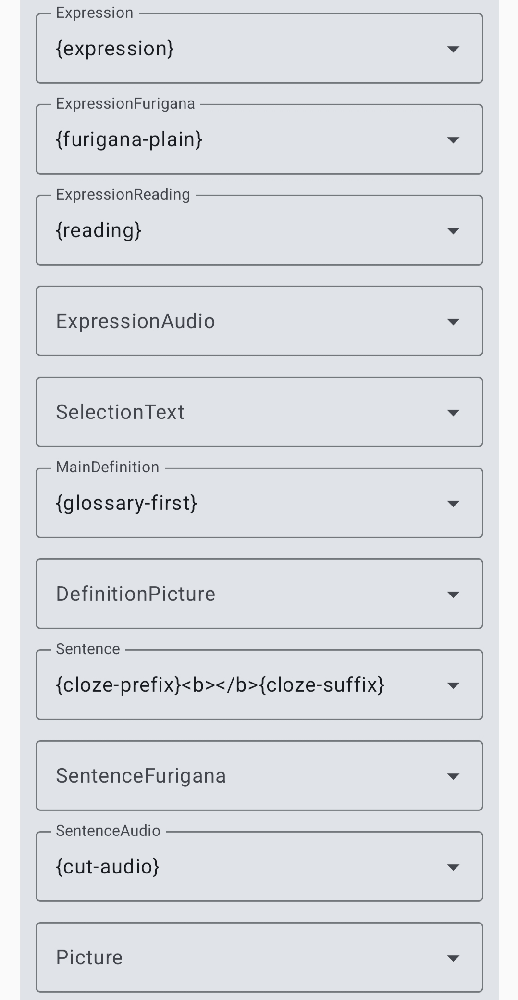
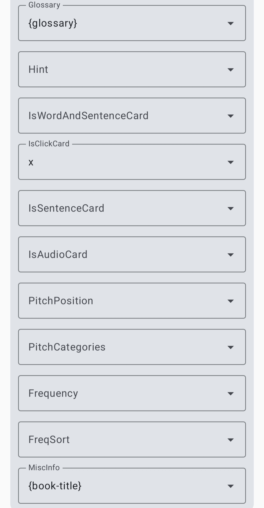

# ⑨Player


Audiobook player with Anki support.

[English](README.md) | [简体中文](README.zh-CN.md) | [繁體中文](README.zh-TW.md)

## Features

Play audiobooks  
Export to Anki (Only support japanese now)

### Core Player Features
- Timer, speed, and other basic playback functions
- Cover/subtitle view switching
- Bookshelf/list view switching

### m4b
- Chapters
- Tap to switch chapter/total duration and progress display

### Extended Features
- [Control Mode](#control-mode)
- [Floating Bubble](#floating-bubble)
- Sentence bookmarking
- [Controller](#controller) support

### [Mining Workflow](#mining-workflow)
- [Audio](#audio)
- Import Yomitan dictionaries
- Tap subtitles to look up words or look up from bookmarks
- Export to Anki

---

# Add Audiobook

After tapping `+` at the bottom-right:

1. Select the audiobook folder.
2. Select audio and SRT.
3. If "auto move to audiobook folder" is enabled, the app will:
   - Create an `AudX` folder under your audiobook folder.
   - Move audio and SRT into that folder.

```text
Example:

audiobook-folder/
├── Aud1/
│   ├── 1.mp3
│   └── 1.srt
└── Aud2/
    ├── 2.m4b
    └── 2.srt
```

SRT reference:
[SubPlz](https://github.com/kanjieater/SubPlz)

## Mining Workflow

Supports Yomitan vocabulary, pitch accent, and frequency dictionaries.

Collection
- [marv](https://github.com/MarvNC/yomitan-dictionaries?tab=readme-ov-file#dictionary-collection)
- [uchagikun](https://github.com/SalwynnJP/yomitan-dictionaries)
- [Shoui](https://learnjapanese.moe/yomichan/#acquiring-dictionaries)

You can refer to the settings below:

<p>
  
  
</p>

```text
{cloze-prefix}<b>{cloze-body}</b>{cloze-suffix}
```
```text
{cut-audio} sentence audio
{book-title} audio file name
```

Anki template: [Lapis](https://github.com/donkuri/lapis)

## Controller

To use "Disconnect controller Bluetooth":

1. Install and configure Shizuku.
2. Go to `Settings -> Controller Bluetooth`.
3. Tap request Shizuku permission.

## Audio

Use local TTS or import [android.db](https://github.com/KamWithK/AnkiconnectAndroid?tab=readme-ov-file#additional-instructions-local-audio).

## Control Mode

Used for gesture-based control.

In control mode, the screen does not turn off naturally.

## Floating Bubble

Enable in `Settings -> Audiobooks`.

While playing an audiobook, return to home/switch apps to show it.

Single tap: Play/Pause.  
Double tap: Expand the control bar.

## Credits

- [hoshidicts](https://github.com/Manhhao/hoshidicts)
- [Hoshi-Reader](https://github.com/Manhhao/Hoshi-Reader)
- [Ankiconnect Android](https://github.com/KamWithK/AnkiconnectAndroid) (local audio)
- [Yomitan](https://github.com/yomidevs/yomitan)
- [Voice](https://github.com/PaulWoitaschek/Voice)
- [AudioConverter](https://github.com/renezuidhof/AudioConverter)
- [taglib](https://github.com/Kyant0/taglib)

## License

This project is licensed under [GPLv3.0](LICENSE).
